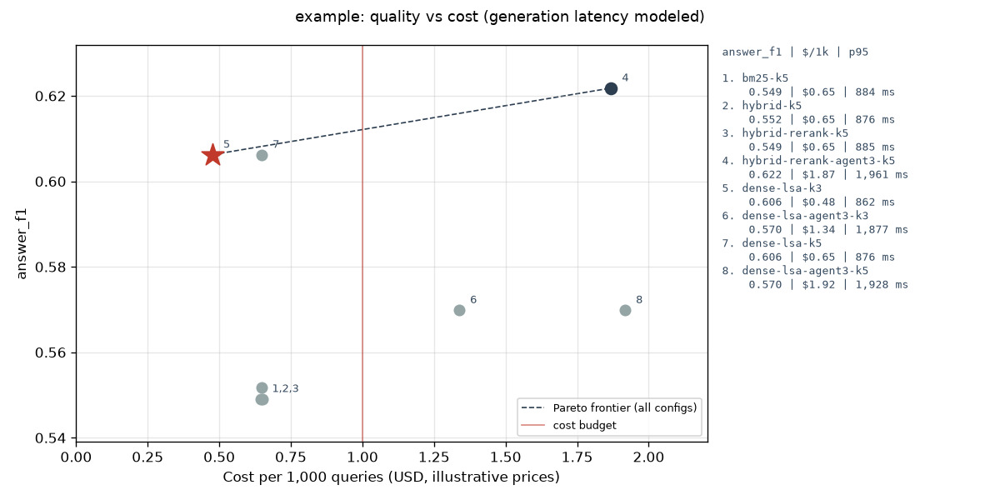
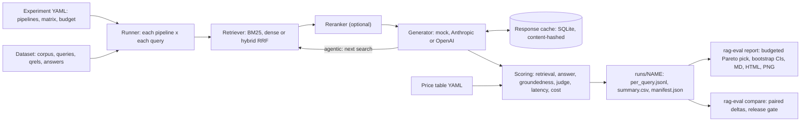

# ragbench


ragbench compares retrieval-augmented and agentic search pipelines side by side on retrieval
quality, answer quality, groundedness, latency and cost-to-serve, then picks a configuration
under a cost and latency budget and says how sure it is. A YAML file declares a matrix of
pipelines (BM25, dense, hybrid with reciprocal rank fusion, an optional reranker, single-shot
or multi-step agentic retrieval); one command runs them over a dataset, and another turns the
results into a Markdown/HTML report with a quality-vs-cost chart and paired bootstrap
confidence intervals against a baseline. Everything runs offline by default: a deterministic
extractive generator and a rubric judge stand in for LLMs, and Anthropic/OpenAI adapters are
optional extras.

## Quickstart

Requires Python 3.11+ and [uv](https://docs.astral.sh/uv/).

```bash
git clone https://github.com/seanmcrae/ragbench.git && cd ragbench
uv sync --frozen                                         # or: make install
uv run rag-eval run configs/example.yaml                 # 8 pipelines x 55 queries, offline
uv run rag-eval report                                   # runs/example/report.{md,html} + chart
uv run rag-eval compare bm25-k5 hybrid-rerank-agent3-k5  # paired deltas with 95% CIs
```

`make demo` runs the same three commands; `make ci` runs lint, type check and tests. To use a
hosted model instead of the mock, install an extra and export its key:

```bash
uv sync --frozen --extra anthropic && export ANTHROPIC_API_KEY=...
# in the experiment YAML: generator: {provider: anthropic, model: claude-haiku-4-5}
#                         judge:     {provider: openai, model: gpt-4o-mini}
```

## Example output

Captured from `make demo` on the bundled **synthetic** help-center corpus (176 documents,
55 queries). Costs use the illustrative price table in `configs/prices.yaml` (dated
2026-10-07) with the mock's tokens priced as `claude-haiku-4-5`; generation latency is
modeled from token counts, retrieval latency is measured.

```text
$ rag-eval run configs/example.yaml
pipeline                 answer_f1  exact_match  judge_score  groundedness  nDCG@5  recall@5    MRR  p50 ms  p95 ms  $/1k q  steps
bm25-k5                      0.549        0.418        0.573         0.909   0.802     0.818  0.891     652     884   0.646   1.00
hybrid-k5                    0.552        0.436        0.573         0.909   0.810     0.818  0.938     653     876   0.650   1.00
hybrid-rerank-k5             0.549        0.418        0.573         0.909   0.795     0.809  0.903     680     885   0.651   1.00
hybrid-rerank-agent3-k5      0.622        0.491        0.645         0.927   0.795     0.809  0.903   1,605   1,961   1.868   1.67
dense-lsa-k3                 0.606        0.491        0.627         0.909   0.830     0.818  0.979     636     862   0.475   1.00
dense-lsa-agent3-k3          0.570        0.455        0.591         0.927   0.827     0.800  0.979   1,546   1,877   1.337   1.73
dense-lsa-k5                 0.606        0.491        0.627         0.909   0.830     0.818  0.979     650     876   0.647   1.00
dense-lsa-agent3-k5          0.570        0.455        0.591         0.927   0.830     0.818  0.979   1,599   1,928   1.916   1.65

results: runs/example  (cache hits 266, misses 881)

$ rag-eval report --img-dir docs/img
Budget: cost <= $1.00 per 1k queries and p95 latency <= 1,500 ms. Selection: highest answer_f1 on the in-budget Pareto frontier.
Recommended: dense-lsa-k3 (answer_f1 0.606, $0.475 per 1k queries, p95 862 ms).
Versus the baseline bm25-k5: +0.057 answer_f1 [-0.013, +0.145], no significant difference at 95% over 55 queries.
Best answer_f1 regardless of budget: hybrid-rerank-agent3-k5 (0.622, +0.016 vs the recommendation) at 3.9x the cost and 2.3x the p95 latency.
In-budget Pareto frontier (cheapest first): dense-lsa-k3.
In budget but dominated: bm25-k5, hybrid-k5, hybrid-rerank-k5, dense-lsa-k5.
Over budget: hybrid-rerank-agent3-k5 (cost $1.868/1k > $1.00; p95 1961 ms > 1500 ms); dense-lsa-agent3-k3 (cost $1.337/1k > $1.00; p95 1877 ms > 1500 ms); dense-lsa-agent3-k5 (cost $1.916/1k > $1.00; p95 1928 ms > 1500 ms).

$ rag-eval compare bm25-k5 hybrid-rerank-agent3-k5
hybrid-rerank-agent3-k5 vs bm25-k5 over 55 queries (B - A, 95% CI)
metric               A       B    delta
answer_f1        0.549   0.622   +0.073   [+0.018, +0.145]   p=0.038
exact_match      0.418   0.491   +0.073   [+0.018, +0.145]   p=0.038
judge_score      0.573   0.645   +0.073   [+0.018, +0.145]   p=0.038
groundedness     0.909   0.927   +0.018   [+0.000, +0.055]   p=0.695
ndcg@5           0.802   0.795   -0.007   [-0.027, +0.016]   p=0.485
mrr              0.891   0.903   +0.012   [-0.009, +0.039]   p=0.450
$/1k queries     0.646   1.868   +1.222
p95 ms             884    1961    +1077

GATE PASS: no significant drop larger than 0.0 on answer_f1.
```



What the run says, on this synthetic data:

- **Top-k is a cost lever, not a quality lever here.** `dense-lsa-k3` and `dense-lsa-k5` score
  the same answer F1, and k3 is 27% cheaper per query (shorter prompts).
- **The agentic loop buys multi-hop answers.** On the 8 multi-hop questions, answer F1 goes
  from 0.00 (every single-shot pipeline) to 0.50 with `hybrid-rerank-agent3-k5`, the only
  statistically significant win over the baseline, at 2.9x the cost and 2.2x the p95.
- **Agents over-search.** That pipeline issued follow-up searches on 34 of 55 queries although
  only 8 need a second hop, and on the dense retriever the same loop lost single-hop answers
  (integration-sync F1 1.00 to 0.40), so it scores below its single-shot twin.
- **The recommendation is a cost call.** `dense-lsa-k3` is the cheapest and fastest config and
  has the best single-shot F1, but its +0.057 lift over BM25 is not significant at n=55.

The report also breaks quality down by query type; `runs/example/report.md` and the
self-contained `report.html` carry every table.

## Architecture



| Module | Responsibility |
|---|---|
| `datasets/` | `Dataset` model, BEIR-format loader/writer, seeded synthetic generator |
| `retrieval/` | BM25, dense retrieval over pluggable embedders, RRF hybrid, rerankers |
| `generation/` | `Generator` protocol, extractive mock, LLM generator, Anthropic/OpenAI clients |
| `judge.py` | Shared rubric; heuristic judge (default) and LLM-as-judge |
| `pipeline.py` | Retrieve, rerank, generate; agentic loop with a step budget; per-stage timing |
| `metrics/` | recall/precision/MRR/nDCG@k, token F1/EM, citation groundedness, percentiles |
| `cost.py` | Token usage, price table, cost per 1k queries |
| `cache.py` | Content-addressed generation and judge cache |
| `config.py`, `factory.py`, `runner.py`, `results.py` | Experiment matrix, wiring, persistence, summaries |
| `stats.py`, `pareto.py`, `report/` | Paired bootstrap, frontier and budget pick, rendering |

## Design decisions

- **Offline by default, same code path online.** The mock generator receives the exact prompt
  an API model would, so token counts and cost scale with context size and step count the way
  they would in production. Keys are only read when a hosted provider is configured.
- **Latency is honest about where it comes from.** Retrieval and reranking are timed
  wall-clock. API generations are timed wall-clock; the mock reports a modeled latency
  (350 ms + 0.08 ms per input token + 15 ms per output token) and every report says so.
- **Cache keys hash content, not ids.** A key covers the generator's identity and parameters,
  the question, prior searches and each passage's id and text hash. Editing a document
  invalidates exactly the generations that saw it. Cached entries keep their original latency
  so a warm re-run does not flatter a pipeline.
- **Paired bootstrap over queries.** Pipelines answer the same questions, so the harness
  resamples per-query differences rather than comparing two independent means; with 55
  queries that is the difference between a usable interval and noise.
- **A release gate needs significance and size.** `compare --fail-on-regression` fails only
  when the CI of the delta is entirely below zero and the point estimate is worse than
  `--tolerance`. Either condition alone either blocks on noise or ships real regressions.
- **The recommendation is constrained, then Pareto.** Configs over the cost or p95 budget are
  dropped with the reason recorded; the pick is the highest-quality point on the in-budget
  frontier of (quality, cost, p95), ties to cheaper then faster.
- **Rank fusion, not score fusion.** RRF (k=60) ignores raw scores, which live on incomparable
  scales for BM25 and cosine similarity.
- **Own BM25 and BEIR's file format.** A 60-line BM25 over an inverted index with Lucene's non-negative IDF
  is easier to verify (there is a hand-computed test) than a dependency, and the BEIR layout
  means public benchmarks load without conversion.
- **Prices are configuration.** `configs/prices.yaml` is labeled illustrative and dated; a
  missing model is a loud error naming the known models.

## Data

- **Bundled synthetic corpus** (`data/synthetic_helpcenter/`, generated by
  `scripts/generate_synthetic.py` from `src/rag_eval/datasets/synthetic.py`, seed 7): the help
  center of *Tallyhive*, a fictional invoicing and time-tracking SaaS. 176 short documents
  (plan limits, feature setup, plan availability, integrations, error codes, policies, release
  notes) and 55 queries across 10 types, 8 of them multi-hop ("What is the seat cap on the
  cheapest plan that includes SAML single sign-on?"). Qrels are graded (2 = states the answer,
  1 = supporting or bridge document) and every query has a reference answer. All content is
  invented; real product names appear only as integration targets. A test asserts the
  committed files hash identically to fresh generator output.
- **BEIR SciFact (optional)**: `scripts/download_scifact.py` fetches
  `https://public.ukp.informatik.tu-darmstadt.de/thakur/BEIR/datasets/scifact.zip` and checks
  the MD5 published in the BEIR README. SciFact (Wadden et al., 2020) is licensed
  **CC BY-NC 2.0**; it is never downloaded by tests or CI and is git-ignored. It has no
  reference answers, so answer metrics are skipped and `configs/scifact.yaml` ranks on
  nDCG@10. As a sanity check, a local run of that config gave BM25 (k1=0.9, b=0.4) nDCG@10
  0.641 on the 300 test queries, against 0.665 reported for BM25 in the BEIR paper (Table 2).

## Limitations

- The mock generator and planner are lexical heuristics. They make relative comparisons
  between retrieval configurations meaningful offline, but absolute answer quality and the
  agentic results describe the heuristics, not an LLM. Lexical gaps defeat them: every
  pipeline scores 0 on "what data does X sync" because the answer sentence says "synced".
- The synthetic corpus is templated, single-domain and small. Its phrasing patterns favour
  copular fact sentences, and n=55 gives wide intervals (the recommended config's lift is not
  significant). Use it to exercise the harness; decide on your own queries.
- The heuristic judge maps token F1 and citation coverage onto the rubric, so it agrees with
  answer F1 by construction. An LLM judge adds signal but brings its own biases (see
  [docs/PRODUCT.md](docs/PRODUCT.md)).
- For agentic pipelines the retrieval metrics score passages in the order the generator saw
  them, so hop results can sit beyond rank k.
- Offline token counts are an approximation (about 4 characters per token); API adapters use
  provider-reported usage. Cost-to-serve excludes corpus indexing and the judge.
- No live traffic: these are offline metrics. Click-through, deflection or CSAT need an online
  experiment.

## Roadmap

Product framing, success metrics, trade-offs and the now/next/later roadmap are in
[docs/PRODUCT.md](docs/PRODUCT.md).

## License

MIT, see [LICENSE](LICENSE). The optional SciFact dataset carries its own CC BY-NC 2.0 license.
