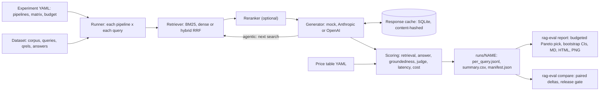

# ragbench

[](https://github.com/seanmcrae/ragbench/actions/workflows/ci.yml)
[](https://seanmcrae.github.io/ragbench/)
[](LICENSE)
[](pyproject.toml)

Choose a RAG configuration on evidence: ragbench scores retrieval and agentic search pipelines
on retrieval quality, answer quality, groundedness, latency and cost-to-serve, and recommends one
under a budget with confidence intervals.

**Live docs and results:** https://seanmcrae.github.io/ragbench/

A YAML file declares a matrix of pipelines (BM25, dense, hybrid with reciprocal rank fusion, an
optional reranker, single-shot or multi-step agentic retrieval); one command runs them over a
dataset, and another turns the results into a Markdown/HTML report with a quality-vs-cost chart
and paired bootstrap confidence intervals against a baseline. Everything runs offline by
default: a deterministic extractive generator and a rubric judge stand in for LLMs, and
Anthropic/OpenAI adapters are optional extras.

**Headline result** (bundled synthetic corpus, 8 pipelines x 55 queries, offline mock
generator): under a budget of $1.00 per 1k queries and 1,500 ms p95, ragbench picks
`dense-lsa-k3` (answer F1 0.606, $0.475 per 1k queries, p95 862 ms). The only statistically
significant gain over the BM25 baseline is the agentic `hybrid-rerank-agent3-k5`
(+0.073 answer F1, 95% CI [+0.018, +0.145]), and it costs 2.9x as much per query.


## Quickstart

Requires Python 3.11+ and [uv](https://docs.astral.sh/uv/). One command runs the whole demo
offline, with no API keys:

```bash
git clone https://github.com/seanmcrae/ragbench.git && cd ragbench && make demo
```

`make demo` runs these three steps, which you can also run one at a time:

```bash
uv run rag-eval run configs/example.yaml                 # 8 pipelines x 55 queries
uv run rag-eval report --img-dir docs/img                # runs/example/report.{md,html} + chart
uv run rag-eval compare bm25-k5 hybrid-rerank-agent3-k5  # paired deltas with 95% CIs
```

Other targets: `make ci` (lint, format check, type check, tests), `make site` (the static docs
site in `site/`), `make scifact` (optional public benchmark, downloads about 3 MB). To use a
hosted model instead of the mock, install an extra and export its key:

```bash
uv sync --frozen --extra anthropic && export ANTHROPIC_API_KEY=...
# in the experiment YAML: generator: {provider: anthropic, model: claude-haiku-4-5}
#                         judge:     {provider: openai, model: gpt-4o-mini}
```

## Features

- **Pipeline matrix from YAML.** Explicit pipelines plus a Cartesian `matrix` merged over
  `defaults`; names are generated from settings (`dense-lsa-agent3-k3`).
- **Retrieval.** BM25 over an inverted index, dense retrieval over pluggable embedders
  (offline TF-IDF/LSA and hashing; sentence-transformers and OpenAI as extras), hybrid
  reciprocal rank fusion, and a query-likelihood or cross-encoder reranker.
- **Single-shot and agentic.** `max_steps > 1` lets the generator issue follow-up searches,
  so multi-hop questions and the cost of over-searching both show up in the numbers.
- **Scoring on one page.** recall/precision/MRR/nDCG@k, token F1 and exact match, citation
  groundedness, a rubric judge (heuristic or LLM), p50/p95 latency per stage, and cost per
  1k queries from a dated price table.
- **Decisions with uncertainty.** Paired bootstrap CIs against a baseline, an in-budget Pareto
  frontier, a recommendation that records why each rejected config was rejected, and a
  `compare --fail-on-regression` release gate for CI.
- **Fast, honest reruns.** A content-addressed SQLite cache serves unchanged generations and
  keeps their original latency, so warm runs do not look faster than cold ones.

## Example output

Captured from `make demo` in a fresh clone, on the bundled **synthetic** help-center corpus
(176 documents, 55 queries). Costs use the illustrative price table in `configs/prices.yaml`
(dated 2026-10-07) with the mock's tokens priced as `claude-haiku-4-5`; generation latency is
modeled from token counts, retrieval latency is measured, so p50/p95 can move by a few
milliseconds between runs.

```text
$ rag-eval run configs/example.yaml
pipeline                 answer_f1  exact_match  judge_score  groundedness  nDCG@5  recall@5    MRR  p50 ms  p95 ms  $/1k q  steps
bm25-k5                      0.549        0.418        0.573         0.909   0.802     0.818  0.891     652     884   0.646   1.00
hybrid-k5                    0.552        0.436        0.573         0.909   0.810     0.818  0.938     658     875   0.650   1.00
hybrid-rerank-k5             0.549        0.418        0.573         0.909   0.795     0.809  0.903     680     885   0.651   1.00
hybrid-rerank-agent3-k5      0.622        0.491        0.645         0.927   0.795     0.809  0.903   1,606   1,962   1.868   1.67
dense-lsa-k3                 0.606        0.491        0.627         0.909   0.830     0.818  0.979     637     862   0.475   1.00
dense-lsa-agent3-k3          0.570        0.455        0.591         0.927   0.827     0.800  0.979   1,548   1,883   1.337   1.73
dense-lsa-k5                 0.606        0.491        0.627         0.909   0.830     0.818  0.979     651     876   0.647   1.00
dense-lsa-agent3-k5          0.570        0.455        0.591         0.927   0.830     0.818  0.979   1,601   1,929   1.916   1.65

results: runs/example  (cache hits 266, misses 881)

$ rag-eval report --img-dir docs/img
Budget: cost <= $1.00 per 1k queries and p95 latency <= 1,500 ms. Selection: highest answer_f1 on the in-budget Pareto frontier.
Recommended: dense-lsa-k3 (answer_f1 0.606, $0.475 per 1k queries, p95 862 ms).
Versus the baseline bm25-k5: +0.057 answer_f1 [-0.013, +0.145], no significant difference at 95% over 55 queries.
Best answer_f1 regardless of budget: hybrid-rerank-agent3-k5 (0.622, +0.016 vs the recommendation) at 3.9x the cost and 2.3x the p95 latency.
In-budget Pareto frontier (cheapest first): dense-lsa-k3.
In budget but dominated: bm25-k5, hybrid-k5, hybrid-rerank-k5, dense-lsa-k5.
Over budget: hybrid-rerank-agent3-k5 (cost $1.868/1k > $1.00; p95 1962 ms > 1500 ms); dense-lsa-agent3-k3 (cost $1.337/1k > $1.00; p95 1883 ms > 1500 ms); dense-lsa-agent3-k5 (cost $1.916/1k > $1.00; p95 1929 ms > 1500 ms).

$ rag-eval compare bm25-k5 hybrid-rerank-agent3-k5
hybrid-rerank-agent3-k5 vs bm25-k5 over 55 queries (B - A, 95% CI)
metric               A       B    delta
answer_f1        0.549   0.622   +0.073   [+0.018, +0.145]   p=0.038
exact_match      0.418   0.491   +0.073   [+0.018, +0.145]   p=0.038
judge_score      0.573   0.645   +0.073   [+0.018, +0.145]   p=0.038
groundedness     0.909   0.927   +0.018   [+0.000, +0.055]   p=0.695
ndcg@5           0.802   0.795   -0.007   [-0.027, +0.016]   p=0.485
mrr              0.891   0.903   +0.012   [-0.009, +0.039]   p=0.450
$/1k queries     0.646   1.868   +1.222
p95 ms             884    1962    +1079

GATE PASS: no significant drop larger than 0.0 on answer_f1.
```

## Results

The same run as a table: answer quality, groundedness and retrieval against p95 latency and
cost, with each pipeline's answer F1 difference from the BM25 baseline (paired bootstrap,
2,000 resamples, 55 queries).

| pipeline | answer F1 | judge | grounded | nDCG@5 | p95 ms | $/1k queries | vs bm25-k5 (95% CI) |
|---|---:|---:|---:|---:|---:|---:|---|
| bm25-k5 | 0.549 | 0.573 | 0.909 | 0.802 | 884 | 0.646 | baseline |
| hybrid-k5 | 0.552 | 0.573 | 0.909 | 0.810 | 875 | 0.650 | +0.003 [-0.047, +0.055] |
| hybrid-rerank-k5 | 0.549 | 0.573 | 0.909 | 0.795 | 885 | 0.651 | +0.000 [+0.000, +0.000] |
| hybrid-rerank-agent3-k5 | 0.622 | 0.645 | 0.927 | 0.795 | 1,962 | 1.868 | +0.073 [+0.018, +0.145] significant |
| **dense-lsa-k3** (recommended) | 0.606 | 0.627 | 0.909 | 0.830 | 862 | 0.475 | +0.057 [-0.013, +0.145] |
| dense-lsa-agent3-k3 | 0.570 | 0.591 | 0.927 | 0.827 | 1,883 | 1.337 | +0.021 [-0.031, +0.091] |
| dense-lsa-k5 | 0.606 | 0.627 | 0.909 | 0.830 | 876 | 0.647 | +0.057 [-0.013, +0.145] |
| dense-lsa-agent3-k5 | 0.570 | 0.591 | 0.927 | 0.830 | 1,929 | 1.916 | +0.021 [-0.031, +0.091] |

What the run says, on this synthetic data:

- **Top-k is a cost lever, not a quality lever here.** `dense-lsa-k3` and `dense-lsa-k5` score
  the same answer F1, and k3 is 27% cheaper per query (shorter prompts).
- **The agentic loop buys multi-hop answers.** On the 8 multi-hop questions, answer F1 goes
  from 0.00 (every single-shot pipeline) to 0.50 with `hybrid-rerank-agent3-k5`, the only
  statistically significant win over the baseline, at 2.9x the cost and 2.2x the p95.
- **Agents over-search.** That pipeline issued follow-up searches on 34 of 55 queries although
  only 8 need a second hop, and on the dense retriever the same loop lost single-hop answers
  (integration-sync F1 1.00 to 0.40), so it scores below its single-shot twin.
- **The recommendation is a cost call.** `dense-lsa-k3` is the cheapest and fastest config and
  has the best single-shot F1, but its +0.057 lift over BM25 is not significant at n=55.

`runs/example/report.md` and the self-contained `report.html` carry every table, including
answer F1 broken down by query type. The [docs site](https://seanmcrae.github.io/ragbench/)
renders the same tables, regenerated from a fresh run on every push to `main`.

## How evaluation works

1. **Run.** Each pipeline answers every query: retrieve top-k (optionally rerank from a deeper
   pool), build a prompt from the passages, generate an answer with `[doc-id]` citations. An
   agentic pipeline may ask for another search, up to `max_steps`. Every stage is timed and
   every completion records its token usage.
2. **Score each query.**
   - *Retrieval*: recall@k, precision@k, MRR and nDCG@k against graded qrels (2 = states the
     answer, 1 = supporting or bridge document).
   - *Answer*: SQuAD-style token F1 and exact match against the reference answers.
   - *Groundedness*: share of answer sentences that cite a retrieved document, times the share
     of the answer's content terms found in the documents it cites. Uncited answers score 0.
   - *Judge*: a 1-5 rubric (correct, complete, supported by cited passages) normalised to
     [0, 1]; the offline judge maps F1 and citation coverage onto it, an LLM judge reads the
     passages.
   - *Latency and cost*: per-stage wall-clock (modeled for the mock generator), and tokens
     priced from `configs/prices.yaml`.
3. **Summarise.** Means per pipeline, p50/p95 latency, cost per 1k queries, quality by query
   type.
4. **Decide.** Drop configurations over the cost or p95 budget (reasons recorded), take the
   Pareto frontier of (quality, cost, p95) among the rest, and pick the highest quality, ties
   to cheaper then faster. Deltas against the baseline use a paired bootstrap over queries.
5. **Gate.** `rag-eval compare A B --fail-on-regression` exits 1 only when B's gate metric is
   significantly worse than A's (the CI excludes zero) and the drop exceeds `--tolerance`.

## Architecture



| Module | Responsibility |
|---|---|
| `datasets/` | `Dataset` model, BEIR-format loader/writer, seeded synthetic generator |
| `retrieval/` | BM25, dense retrieval over pluggable embedders, RRF hybrid, rerankers |
| `generation/` | `Generator` protocol, extractive mock, LLM generator, Anthropic/OpenAI clients |
| `judge.py` | Shared rubric; heuristic judge (default) and LLM-as-judge |
| `pipeline.py` | Retrieve, rerank, generate; agentic loop with a step budget; per-stage timing |
| `metrics/` | recall/precision/MRR/nDCG@k, token F1/EM, citation groundedness, percentiles |
| `cost.py` | Token usage, price table, cost per 1k queries |
| `cache.py` | Content-addressed generation and judge cache |
| `config.py`, `factory.py`, `runner.py`, `results.py` | Experiment matrix, wiring, persistence, summaries |
| `stats.py`, `pareto.py`, `report/` | Paired bootstrap, frontier and budget pick, rendering |

## Design decisions

- **Offline by default, same code path online.** The mock generator receives the exact prompt
  an API model would, so token counts and cost scale with context size and step count the way
  they would in production. Keys are only read when a hosted provider is configured.
- **Latency is honest about where it comes from.** Retrieval and reranking are timed
  wall-clock. API generations are timed wall-clock; the mock reports a modeled latency
  (350 ms + 0.08 ms per input token + 15 ms per output token) and every report says so.
- **Cache keys hash content, not ids.** A key covers the generator's identity and parameters,
  the question, prior searches and each passage's id and text hash. Editing a document
  invalidates exactly the generations that saw it. Cached entries keep their original latency
  so a warm re-run does not flatter a pipeline.
- **Paired bootstrap over queries.** Pipelines answer the same questions, so the harness
  resamples per-query differences rather than comparing two independent means; with 55
  queries that is the difference between a usable interval and noise.
- **A release gate needs significance and size.** `compare --fail-on-regression` fails only
  when the CI of the delta is entirely below zero and the point estimate is worse than
  `--tolerance`. Either condition alone either blocks on noise or ships real regressions.
- **The recommendation is constrained, then Pareto.** Configs over the cost or p95 budget are
  dropped with the reason recorded; the pick is the highest-quality point on the in-budget
  frontier of (quality, cost, p95), ties to cheaper then faster.
- **Rank fusion, not score fusion.** RRF (k=60) ignores raw scores, which live on incomparable
  scales for BM25 and cosine similarity.
- **Own BM25 and BEIR's file format.** A 60-line BM25 over an inverted index with Lucene's non-negative IDF
  is easier to verify (there is a hand-computed test) than a dependency, and the BEIR layout
  means public benchmarks load without conversion.
- **Prices are configuration.** `configs/prices.yaml` is labeled illustrative and dated; a
  missing model is a loud error naming the known models.

## Data

- **Bundled synthetic corpus** (`data/synthetic_helpcenter/`, generated by
  `scripts/generate_synthetic.py` from `src/rag_eval/datasets/synthetic.py`, seed 7): the help
  center of *Tallyhive*, a fictional invoicing and time-tracking SaaS. 176 short documents
  (plan limits, feature setup, plan availability, integrations, error codes, policies, release
  notes) and 55 queries across 10 types, 8 of them multi-hop ("What is the seat cap on the
  cheapest plan that includes SAML single sign-on?"). Qrels are graded (2 = states the answer,
  1 = supporting or bridge document) and every query has a reference answer. All content is
  invented; real product names appear only as integration targets. A test asserts the
  committed files hash identically to fresh generator output.
- **BEIR SciFact (optional)**: `scripts/download_scifact.py` fetches
  `https://public.ukp.informatik.tu-darmstadt.de/thakur/BEIR/datasets/scifact.zip` and checks
  the MD5 published in the BEIR README. SciFact (Wadden et al., 2020) is licensed
  **CC BY-NC 2.0**; it is never downloaded by tests or CI and is git-ignored. It has no
  reference answers, so answer metrics are skipped and `configs/scifact.yaml` ranks on
  nDCG@10. As a sanity check, a local run of that config gave BM25 (k1=0.9, b=0.4) nDCG@10
  0.641 on the 300 test queries, against 0.665 reported for BM25 in the BEIR paper (Table 2).

## Configuration

An experiment is one YAML file; `configs/example.yaml` is annotated. Top-level keys:

| Key | Meaning | Default |
|---|---|---|
| `name` | Run name; results go to `output_dir/name/` | required |
| `dataset` | `{kind: synthetic}` or `{kind: beir, path: ..., split: test}`; optional `limit` | synthetic |
| `pipelines` / `matrix` / `defaults` | Explicit pipelines, Cartesian axes, shared settings | |
| `quality_metric` | Metric the recommendation ranks on | `answer_f1` |
| `baseline` | Pipeline the deltas are measured against | first pipeline |
| `budget` | `max_cost_per_1k_usd`, `max_p95_latency_ms` | none |
| `prices` | Price table YAML (USD per million tokens, dated) | `configs/prices.yaml` |
| `judge` | `{provider: heuristic}`, or `anthropic` / `openai` with a `model` | heuristic |
| `metrics_k` | Cut-offs for retrieval metrics | `[1, 3, 5, 10]` |
| `bootstrap_samples`, `seed` | Bootstrap resamples and RNG seed | 2000, 0 |
| `output_dir`, `cache_dir` | Where runs and the response cache live | `runs`, `.rag_eval_cache` |

Per pipeline: `retriever` (`bm25` with `k1`/`b`, `dense` with an `embedder`, `hybrid` with
`components`, `rrf_k`, `weights`), `reranker` (`query-likelihood` or `cross-encoder`, `depth`),
`generator` (`mock`, `anthropic`, `openai`; `model`, `max_tokens`, and `price_as` for the
mock), `top_k`, `max_steps`. Unknown keys are rejected. Hosted providers read
`ANTHROPIC_API_KEY` or `OPENAI_API_KEY` from the environment and are only imported when used.

## Project layout

```text
configs/            experiment matrices and the dated price table
data/               bundled synthetic corpus (BEIR layout); downloads land in data/downloads/
docs/               PRODUCT.md, architecture diagram source and SVG, site templates, images
scripts/            synthetic data generator, SciFact download, static site builder
src/rag_eval/       the package (see Architecture)
tests/              unit and integration tests, offline and deterministic
```

## Limitations

- The mock generator and planner are lexical heuristics. They make relative comparisons
  between retrieval configurations meaningful offline, but absolute answer quality and the
  agentic results describe the heuristics, not an LLM. Lexical gaps defeat them: every
  pipeline scores 0 on "what data does X sync" because the answer sentence says "synced".
- The synthetic corpus is templated, single-domain and small. Its phrasing patterns favour
  copular fact sentences, and n=55 gives wide intervals (the recommended config's lift is not
  significant). Use it to exercise the harness; decide on your own queries.
- The heuristic judge maps token F1 and citation coverage onto the rubric, so it agrees with
  answer F1 by construction. An LLM judge adds signal but brings its own biases (see
  [docs/PRODUCT.md](docs/PRODUCT.md)).
- For agentic pipelines the retrieval metrics score passages in the order the generator saw
  them, so hop results can sit beyond rank k.
- Offline token counts are an approximation (about 4 characters per token); API adapters use
  provider-reported usage. Cost-to-serve excludes corpus indexing and the judge.
- No live traffic: these are offline metrics. Click-through, deflection or CSAT need an online
  experiment.

## Roadmap

Product framing, success metrics, trade-offs and the now/next/later roadmap are in
[docs/PRODUCT.md](docs/PRODUCT.md). Changes are recorded in [CHANGELOG.md](CHANGELOG.md).

## Contributing

Issues and pull requests are welcome; see [CONTRIBUTING.md](CONTRIBUTING.md) for the
development setup and the checks CI runs, and [SECURITY.md](SECURITY.md) for reporting
vulnerabilities. If you use ragbench in a write-up, [CITATION.cff](CITATION.cff) has the
citation metadata.

## License

MIT, see [LICENSE](LICENSE). The optional SciFact dataset carries its own CC BY-NC 2.0 license.
